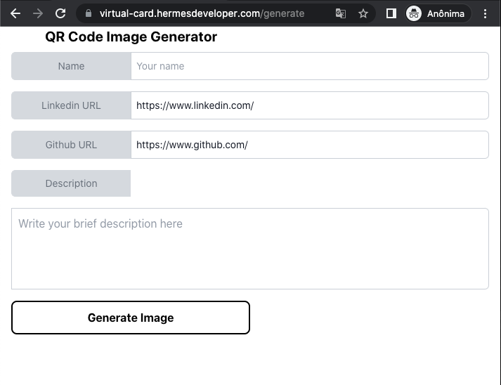
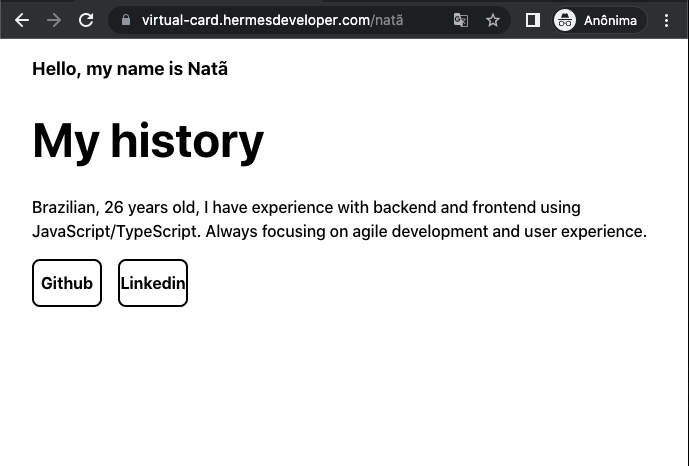

# virtual-card

## Generate Page

This page is responsible for generating the image according to the data provided in the form.

**[Generate page](https://virtual-card.hermesdeveloper.com/generate)**



## Mobile Image Generated

The generated image contains the QR Code that will redirect to a presentation page.


## User Info Page

This page is responsible for displaying the user data registered on the image generation page, as well as the access buttons to the social networks Linkedin and Github.



## Technology stack

- **[React](https://pt-br.reactjs.org/)**
- **[GraphQL](https://graphql.org/)** with **[Hygraph CMS](https://hygraph.com/)**
- **[TailwindCSS](https://tailwindcss.com/)**
- **[Vite.js](https://vitejs.dev/)**

## About project

This project is published online, you can view it here: https://virtual-card.hermesdeveloper.com/generate.
But if you want to run in development mode, follow the steps below.

## Running locally

1. Clone this repo:

```sh
$ git clone https://github.com/natanhermes/virtual-card.git
```

2. Then go to the project's folder:

```sh
cd virtual-card
```

3. Install all dependencies:

```sh
npm install
```

4. Configure your environment variables.

```env
VITE_DOMAIN_URL="your localhost"
VITE_API_URL="api uri to configure apollo client using graphcms/hygraph"
VITE_API_ACCESS_TOKEN="auth token of graphcms/hygraph"
```

5. Clone this project in hygraph

```
https://app.hygraph.com/clone/8584237ce8bf4ccb9d0c727d800960eb?name=Virtual%20Card
```

6. Get your environment variables

```env
VITE_API_URL= get url public content api
```

```env
VITE_API_ACCESS_TOKEN= get token in "Permanent Auth Tokens"
```

4. Run locally:

```sh
npm run dev
```
